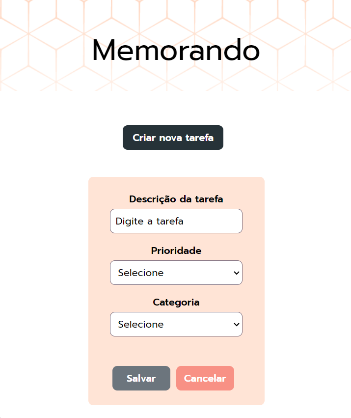
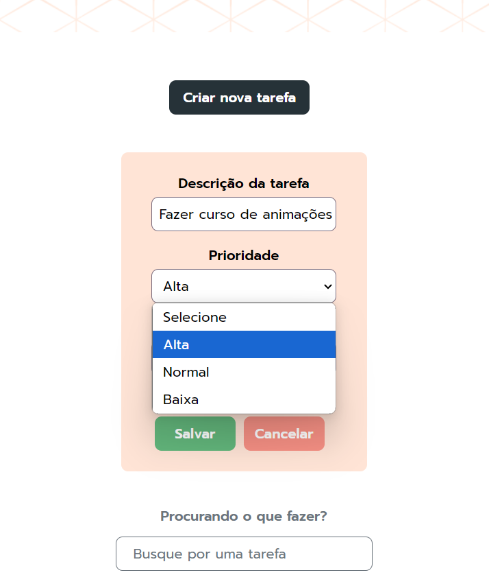
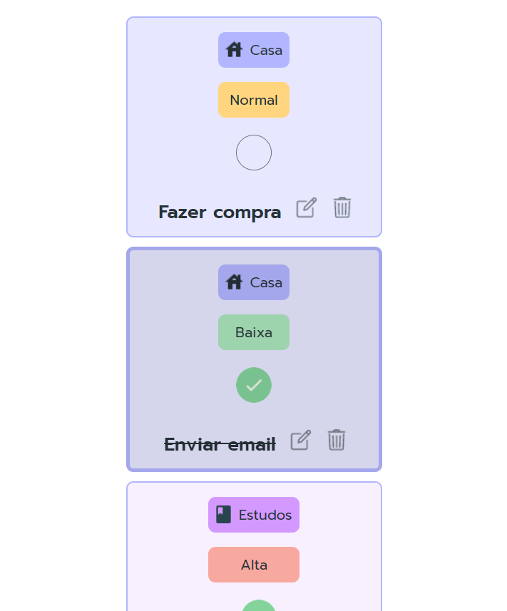
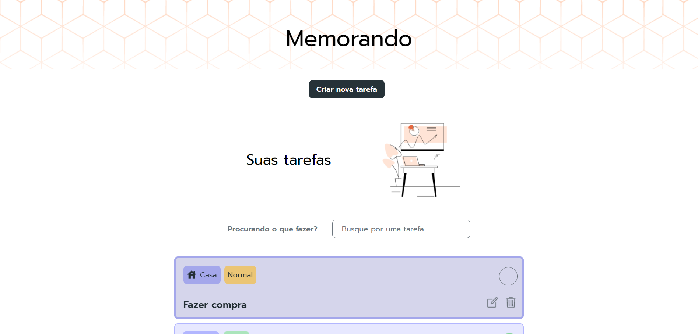
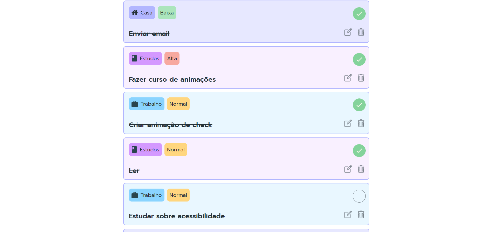

# Lista de tarefas

This project was generated with [Angular CLI](https://github.com/angular/angular-cli) version 15.1.1.

This project is a to-do list application developed in Angular, which allows users to add, remove and mark tasks as completed. What sets this project apart is the inclusion of smooth animations that improve the user experience.

## Development server

Run `ng serve` for a dev server. Navigate to `http://localhost:4200/`. The application will automatically reload if you change any of the source files.

## Build

Run `ng build` to build the project. The build artifacts will be stored in the `dist/` directory.

## Tecnologias Utilizadas

- **Angular**: Framework para construção de aplicações web.
- **TypeScript**: Linguagem utilizada para desenvolvimento no Angular.
- **CSS**: Para animações e transições.

## Instalação Frontend

Siga os passos abaixo para rodar a aplicação localmente:

1. Clone o repositório:
   ```bash
   git clone https://github.com/AndressaTurchetto/task-list-with-angular.git
Navegue até o diretório do projeto:

bash
Copiar código
cd nome-do-repositorio
Instale as dependências:

bash
Copiar código
npm install
Inicie a aplicação:

bash
Copiar código
ng serve
Acesse a aplicação no seu navegador em http://localhost:4200.

## Configuração do Backend

Este projeto utiliza o `json-server` para simular uma API RESTful. Siga os passos abaixo para configurar e rodar o backend:

### Pré-requisitos

- Certifique-se de ter o `json-server` instalado globalmente. Se ainda não o fez, você pode instalá-lo com o seguinte comando:

```bash
npm install -g json-server
Executando o Backend
Navegue até o diretório do backend:
bash
Copiar código
cd backend
Inicie o json-server com o arquivo db.json (ou outro arquivo JSON que você esteja utilizando):
bash
Copiar código
json-server --watch db.json


Contribuição
Contribuições são bem-vindas! Sinta-se à vontade para abrir um pull request ou um issue.

Licença
Este projeto está licenciado sob a MIT License.

markdown
Copiar código








