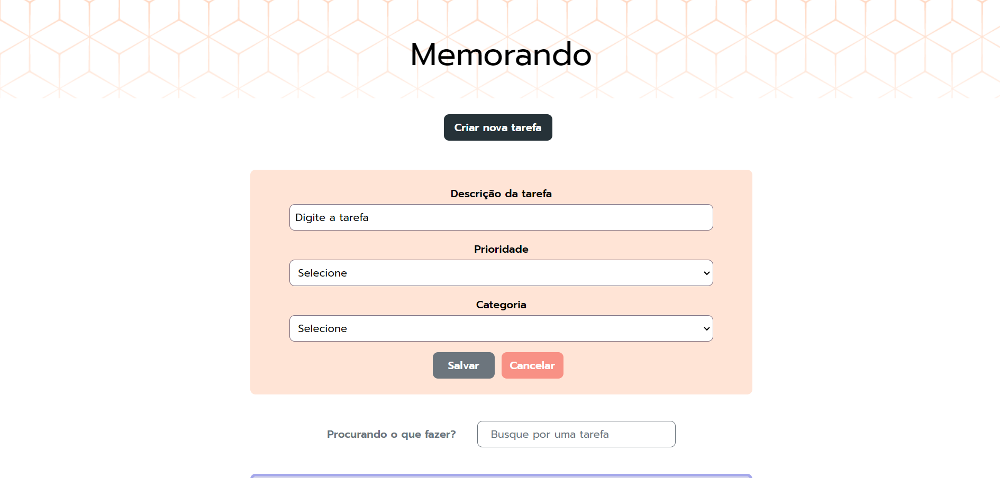
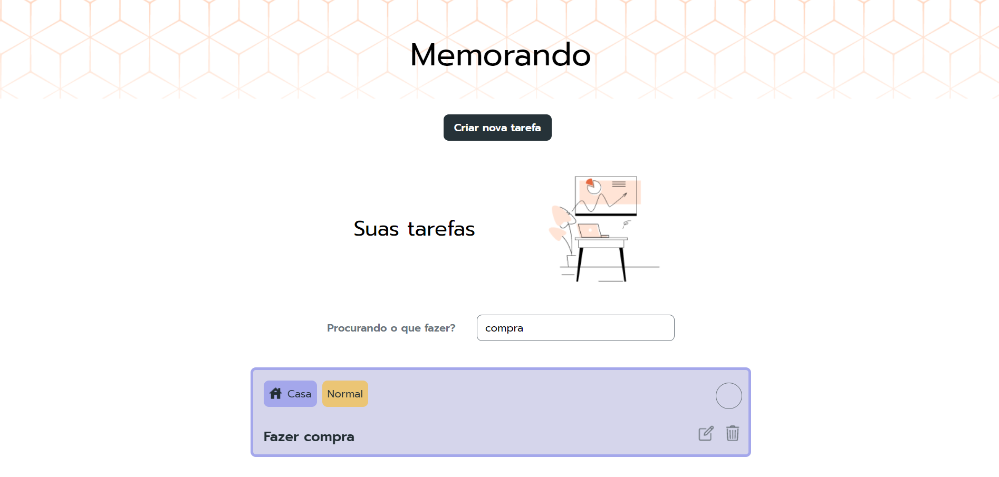

# Lista de tarefas

This project was generated with [Angular CLI](https://github.com/angular/angular-cli) version 15.1.1.

This project is a to-do list application developed in Angular, which allows users to add, remove and mark tasks as completed. What sets this project apart is the inclusion of smooth animations that improve the user experience.

## Tecnologias Utilizadas

- **Angular**: Framework para construção de aplicações web.
- **TypeScript**: Linguagem utilizada para desenvolvimento no Angular.
- **CSS**: Para animações e transições.

## Instalação Frontend

Siga os passos abaixo para rodar a aplicação localmente:

1. Clone o repositório:
   ```bash
   git clone https://github.com/AndressaTurchetto/task-list-with-angular.git
Navegue até o diretório do projeto:

bash
Copiar código
cd nome-do-repositorio
Instale as dependências:

bash
Copiar código
npm install

Inicie a aplicação:
bash
ng serve
Acesse a aplicação no seu navegador em http://localhost:4200.

## Configuração do Backend

- Instale o `json-server` com o seguinte comando:

    ```bash
npm install -g json-server
Navegue até o diretório do backend:
bash
Copiar código
cd backend
Inicie o json-server com o arquivo db.json (ou outro arquivo JSON que você esteja utilizando):
bash
Copiar código
json-server --watch db.json 








